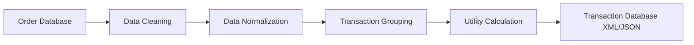
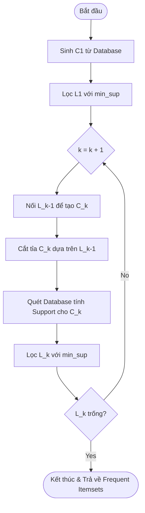
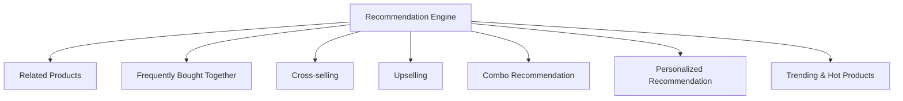
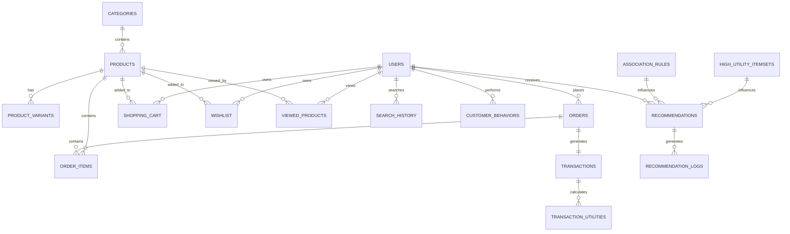
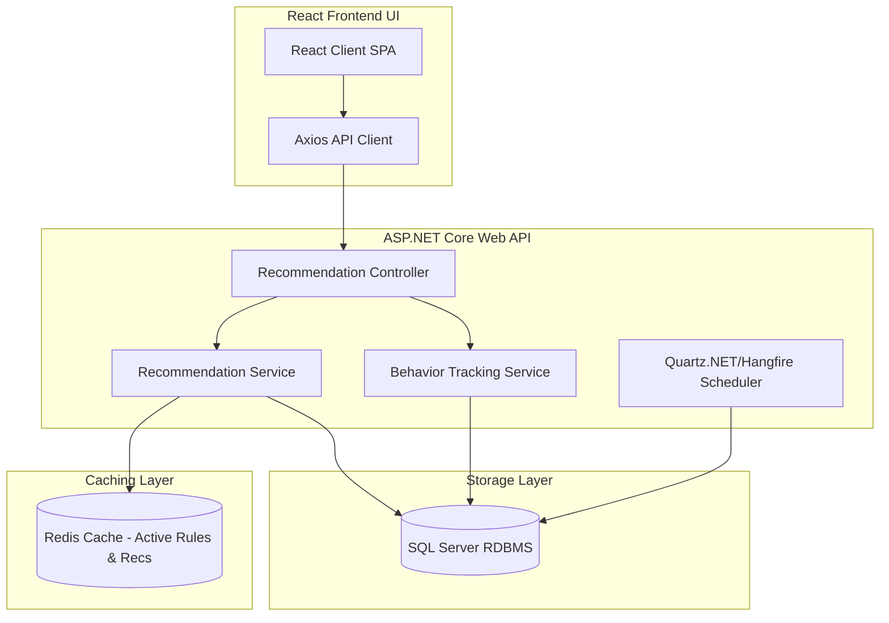
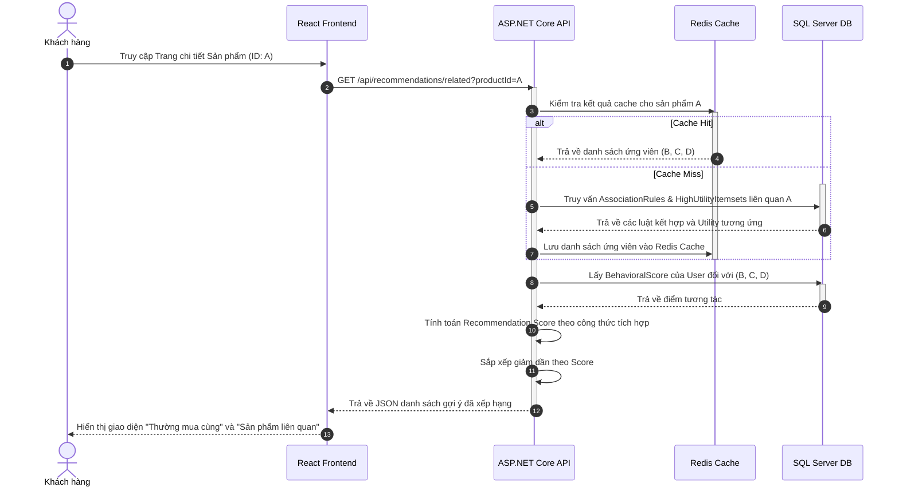

# THIẾT KẾ HỆ THỐNG GỢI Ý SẢN PHẨM KẾT HỢP THUẬT TOÁN APRIORI VÀ HIGH UTILITY ITEMSET MINING (HUI)

---

## 1. MỤC TIÊU HỆ THỐNG (SYSTEM GOALS)

Trong thương mại điện tử hiện đại, việc tối ưu hóa doanh thu và lợi nhuận trên mỗi phiên truy cập của khách hàng là mục tiêu sống còn. Các hệ thống gợi ý sản phẩm truyền thống thường chỉ tập trung vào mức độ phổ biến (Frequent Itemsets) hoặc hành vi người dùng mà bỏ qua khía cạnh giá trị tài chính. Đồ án thiết kế này đề xuất một giải pháp đột phá bằng cách **kết hợp hai thuật toán khai phá dữ liệu cổ điển là Apriori và High Utility Itemset Mining (HUI)** nhằm xây dựng một Recommendation Engine hiệu năng cao mà không phụ thuộc vào các mô hình Machine Learning/Deep Learning phức tạp.

Hệ thống được thiết kế nhằm đạt được các mục tiêu cốt lõi sau:
1. **Tìm kiếm các sản phẩm thường được mua cùng nhau (Co-occurrence Patterns)**: Sử dụng Apriori để phát hiện các quy luật tự nhiên trong giỏ hàng của khách hàng (ví dụ: mua Laptop thường mua kèm Chuột không dây).
2. **Khai phá các tập sản phẩm có giá trị kinh doanh cao (High Utility Itemsets)**: Sử dụng HUI để nhận diện các nhóm sản phẩm mang lại doanh thu hoặc biên lợi nhuận ròng lớn nhất cho doanh nghiệp, ngay cả khi tần suất xuất hiện của chúng không quá cao (ví dụ: Combo Laptop + Bàn phím cơ cao cấp).
3. **Tối ưu hóa đa mục tiêu (Multi-objective Recommendation)**: Kết hợp đồng thời mức độ phổ biến (độ tin cậy của gợi ý) và giá trị kinh doanh (lợi nhuận doanh nghiệp) để xếp hạng các sản phẩm gợi ý, đảm bảo vừa tăng tỷ lệ chuyển đổi (Conversion Rate) vừa tăng giá trị trung bình đơn hàng (AOV - Average Order Value).
4. **Thúc đẩy Cross-selling (Bán chéo) và Upselling (Bán gia tăng)**: Gợi ý các sản phẩm đi kèm phù hợp (Cross-selling) và các phương án thay thế có lợi nhuận cao hơn (Upselling) dựa trên ngữ cảnh giỏ hàng và lịch sử hành vi khách hàng.

---

## 2. DỮ LIỆU ĐẦU VÀO (INPUT DATA MODEL)

Hệ thống được xây dựng trên một cơ sở dữ liệu quan hệ chuẩn hóa. Dưới đây là mô tả cấu trúc của các thực thể chính tham gia vào tiến trình khai phá dữ liệu:

*   **Users (Người dùng)**: Lưu trữ thông tin định danh, tài khoản và phân khúc khách hàng.
*   **Products (Sản phẩm)**: Thông tin cơ bản về sản phẩm (tên, mô tả, trạng thái hoạt động).
*   **Categories (Danh mục sản phẩm)**: Cấu trúc phân cấp danh mục để hỗ trợ logic gợi ý thay thế (Upselling).
*   **ProductVariants (Biến thể sản phẩm)**: Các phiên bản chi tiết của sản phẩm (màu sắc, cấu hình, kích thước).
*   **ProductPrice (Giá bán)**: Lưu vết lịch sử giá bán thực tế của sản phẩm tại các thời điểm.
*   **ProductCost (Giá vốn/Giá nhập)**: Lưu vết giá vốn để tính toán biên lợi nhuận.
*   **ProductProfit (Lợi nhuận sản phẩm)**: Bảng tính toán sẵn hoặc trường dữ liệu lưu biên lợi nhuận ròng của từng sản phẩm ($Profit = Price - Cost$).
*   **Orders (Đơn hàng) & OrderItems (Chi tiết đơn hàng)**: Nguồn dữ liệu lịch sử giao dịch quan trọng nhất để chạy thuật toán.
*   **ShoppingCart (Giỏ hàng hiện tại) & Wishlist (Danh sách yêu thích)**: Dữ liệu thời gian thực phản ánh mối quan tâm hiện tại của người dùng.

### Chi tiết thực thể OrderItem
Mỗi dòng giao dịch (`OrderItem`) chứa các trường dữ liệu định lượng bắt buộc:
*   `ProductId`: Định danh sản phẩm.
*   `Quantity` ($q$): Số lượng sản phẩm mua trong đơn hàng này.
*   `UnitPrice` ($p$): Giá bán đơn vị của sản phẩm tại thời điểm mua.
*   `Profit` ($pr$): Lợi nhuận ròng đơn vị của sản phẩm ($UnitPrice - UnitCost$).
*   `TotalPrice` ($TotalPrice = q \times UnitPrice$): Tổng doanh thu của dòng sản phẩm.
*   `TotalProfit` ($TotalProfit = q \times Profit$): Tổng lợi nhuận của dòng sản phẩm.

### Định nghĩa và Phương pháp tính Utility (Giá trị/Lợi ích)
Utility ($u$) đại diện cho trọng số hoặc giá trị đóng góp của một mặt hàng (hoặc tập mặt hàng) trong một giao dịch. Hệ thống thiết kế hai phương án tính toán Utility:

#### Phương án 1: Tính theo Biên Lợi nhuận (Profit-based Utility)
$$\text{Utility}(i, T) = \text{Quantity}(i, T) \times \text{Profit}(i)$$
*   **Ưu điểm**: Hướng trực tiếp đến mục tiêu tài chính cốt lõi của doanh nghiệp là tối đa hóa lợi nhuận ròng. Giúp hệ thống ưu tiên giới thiệu các mặt hàng có biên lợi nhuận cao (high-margin products), tránh việc đẩy mạnh các mặt hàng doanh thu cao nhưng giá nhập quá đắt dẫn đến lợi nhuận thực tế thấp.
*   **Nhược điểm**: Có thể dẫn đến việc gợi ý các sản phẩm quá đắt đỏ hoặc kén người mua, làm giảm trải nghiệm của người dùng nếu họ cảm thấy bị "ép" mua các sản phẩm đắt tiền để cửa hàng ăn chênh lệch.

#### Phương án 2: Tính theo Doanh thu (Revenue-based Utility)
$$\text{Utility}(i, T) = \text{Quantity}(i, T) \times \text{UnitPrice}(i, T)$$
*   **Ưu điểm**: Tập trung tối đa hóa tổng doanh số (Top-line revenue), làm tăng chỉ số AOV và đẩy nhanh tốc độ quay vòng vốn lưu động. Rất phù hợp cho các chiến dịch xả kho hoặc tăng trưởng thị phần.
*   **Nhược điểm**: Không phản ánh đúng hiệu quả kinh tế thực tế. Một sản phẩm giá bán $1000$ USD nhưng lợi nhuận chỉ $10$ USD sẽ được đánh giá cao hơn sản phẩm giá bán $100$ USD nhưng lợi nhuận $50$ USD.

**Lựa chọn thiết kế hệ thống**: Để cân bằng giữa trải nghiệm khách hàng và mục tiêu tài chính, hệ thống mặc định sử dụng **Phương án 1 (Profit-based Utility)** cho cấu phần HUI chính nhằm tối đa hóa lợi nhuận thực tế, đồng thời áp dụng hệ số điều chỉnh giá bán ở cấu phần Recommendation Score để tránh đề xuất lệch lạc.

---

## 3. TIỀN XỬ LÝ DỮ LIỆU (DATA PREPROCESSING)

Dữ liệu thô từ cơ sở dữ liệu giao dịch cần trải qua quy trình ETL (Extract, Transform, Load) nghiêm ngặt trước khi đưa vào các công cụ khai phá.



### Các bước tiền xử lý:
1.  **Loại bỏ dữ liệu lỗi (Data Cleaning)**: Loại bỏ các đơn hàng bị hủy (`Cancelled`), hoàn trả (`Refunded`), đơn hàng ảo của tài khoản test, hoặc các dòng sản phẩm có số lượng $q \le 0$ hoặc đơn giá $p < 0$.
2.  **Chuẩn hóa dữ liệu (Normalization)**: Quy đổi tất cả đơn vị tiền tệ về một loại tiền tệ thống nhất (ví dụ: VND hoặc USD) theo tỷ giá tại thời điểm giao dịch.
3.  **Gom các OrderItem thành Transaction (Grouping)**: Nhóm các dòng `OrderItem` có chung `OrderId` thành một bản ghi giao dịch duy nhất dạng:
    $$T_d = \{ (i_1, q_1), (i_2, q_2), \dots, (i_k, q_k) \}$$
4.  **Tính toán các chỉ số Utility**:

#### Transaction Utility (TU)
Là tổng giá trị (Utility) của tất cả các mặt hàng xuất hiện trong giao dịch $T_d$:
$$TU(T_d) = \sum_{i \in T_d} u(i, T_d)$$
*Ý nghĩa*: Cho biết tổng đóng góp tài chính (lợi nhuận/doanh thu) của toàn bộ đơn hàng đó.

#### Item Utility (Tiện ích của một mặt hàng)
Là tổng giá trị đóng góp của mặt hàng $i$ trên toàn bộ cơ sở dữ liệu giao dịch $D$:
$$u(i) = \sum_{T_d \in D \wedge i \in T_d} u(i, T_d)$$
*Ý nghĩa*: Đánh giá sức mạnh tài chính độc lập của từng mặt hàng đơn lẻ.

#### Total Utility of Database
Là tổng giá trị của toàn bộ cơ sở dữ liệu giao dịch $D$:
$$Total\_Utility = \sum_{T_d \in D} TU(T_d)$$
*Ý nghĩa*: Cung cấp giá trị nền tảng để tính toán ngưỡng cắt tỉa (Pruning Threshold) cho thuật toán HUI.

#### Transaction Weighted Utility (TWU)
TWU của một tập sản phẩm $X$ là tổng các Transaction Utility ($TU$) của tất cả các giao dịch có chứa tập sản phẩm $X$:
$$TWU(X) = \sum_{T_d \in D \wedge X \subseteq T_d} TU(T_d)$$
*Ý nghĩa*: Đây là chỉ số quan trọng nhất giúp cắt tỉa không gian tìm kiếm trong HUI. Do thuộc tính Utility không có tính đơn điệu (nếu $X \subset Y$, $u(X)$ có thể nhỏ hơn, bằng hoặc lớn hơn $u(Y)$), ta không thể dùng thuộc tính Utility trực tiếp để cắt tỉa. Tuy nhiên, chỉ số $TWU$ có **tính chất đóng xuống** (Downward Closure Property): Nếu $TWU(X) < min\_util$, thì tất cả các tập cha $Y \supset X$ chắc chắn cũng sẽ có $TWU(Y) < min\_util$ và $u(Y) < min\_util$, cho phép loại bỏ hoàn toàn chúng khỏi không gian tìm kiếm.

---

## 4. THUẬT TOÁN APRIORI

### Frequent Itemset Mining & Nguyên lý Apriori
Frequent Itemset Mining (Khai phá tập mục phổ biến) nhằm tìm ra các nhóm mặt hàng thường xuyên xuất hiện cùng nhau trong cơ sở dữ liệu với tần suất vượt qua một ngưỡng tối thiểu ($min\_sup$).

Thuật toán Apriori hoạt động dựa trên nguyên lý đóng xuống của độ hỗ trợ (Apriori Property / Downward Closure):
> "Mọi tập con của một tập phổ biến đều phải là tập phổ biến. Ngược lại, nếu một tập không phổ biến, mọi tập cha của nó cũng sẽ không phổ biến."

### Các bước thực hiện của Apriori:
1.  **Sinh Candidate 1-itemsets ($C_1$)**: Quét toàn bộ CSDL để đếm tần suất của từng mặt hàng đơn lẻ.
2.  **Lọc Frequent 1-itemsets ($L_1$)**: Loại bỏ các mặt hàng có $Support < min\_sup$.
3.  **Lặp ($k \ge 2$)**:
    *   **Sinh Candidate ($C_k$)**: Thực hiện phép nối tự nhiên (Join) giữa $L_{k-1}$ với chính nó ($L_{k-1} \bowtie L_{k-1}$) để tạo ra các tập ứng viên kích thước $k$.
    *   **Cắt tỉa ứng viên (Prune)**: Loại bỏ các ứng viên trong $C_k$ nếu có bất kỳ tập con kích thước $k-1$ nào của nó không thuộc $L_{k-1}$.
    *   **Tính Support**: Quét CSDL để tính toán Support thực tế của các ứng viên còn lại trong $C_k$.
    *   **Lọc Frequent ($L_k$)**: Giữ lại các ứng viên có Support thực tế $\ge min\_sup$.
4.  **Kết thúc**: Dừng lại khi không sinh thêm được ứng viên mới ($C_k = \emptyset$).



### Các độ đo của Luật Kết hợp (Association Rules Measures)
Từ các tập phổ biến, ta sinh ra các luật dạng $Antecedent (A) \rightarrow Consequent (B)$ và đánh giá qua 4 chỉ số:

1.  **Support ($Sup$)**: Tỷ lệ giao dịch chứa cả $A$ và $B$.
    $$Support(A \rightarrow B) = P(A \cup B) = \frac{\text{Count}(A \cup B)}{N}$$
2.  **Confidence ($Conf$)**: Độ tin cậy của luật - xác suất khách hàng mua $B$ sau khi đã chọn $A$.
    $$Confidence(A \rightarrow B) = P(B | A) = \frac{Support(A \cup B)}{Support(A)}$$
3.  **Lift**: Đánh giá mức độ độc lập hay tương quan giữa hai tập sản phẩm.
    $$Lift(A \rightarrow B) = \frac{Confidence(A \rightarrow B)}{Support(B)} = \frac{P(A \cup B)}{P(A) \times P(B)}$$
    *   $Lift > 1$: Tương quan dương (A và B thu hút lẫn nhau).
    *   $Lift = 1$: Độc lập.
    *   $Lift < 1$: Tương quan âm (A và B thay thế nhau hoặc kị nhau).
4.  **Conviction**: Đo lường mức độ phụ thuộc của luật thông qua tần suất dự đoán sai.
    $$Conviction(A \rightarrow B) = \frac{1 - Support(B)}{1 - Confidence(A \rightarrow B)}$$
    Giá trị Conviction càng cao thể hiện luật càng chặt chẽ (giá trị $\infty$ khi $Confidence = 1$).

### Ứng dụng Luật Kết Hợp trong Recommendation Engine
Hệ thống sử dụng các luật này để xây dựng cấu phần **Frequently Bought Together** và **Cross-selling**:
*   Khi người dùng đang xem trang chi tiết sản phẩm $A$, hệ thống truy vấn các luật có tiền đề chứa $A$ (ví dụ: $A \rightarrow B$). Các sản phẩm hệ quả $B$ sẽ được đưa vào danh sách đề xuất.
*   Khi người dùng đã cho $A, B$ vào giỏ hàng, hệ thống truy vấn các luật có tiền đề $\{A, B\} \rightarrow C$ để đề xuất thêm $C$.

---

## 5. HIGH UTILITY ITEMSET MINING (HUI)

### Các Khái Niệm Cơ Bản
*   **High Utility Itemset (HUI)**: Tập mục có tổng giá trị đóng góp (Utility) thực tế trên toàn cơ sở dữ liệu lớn hơn hoặc bằng một ngưỡng giá trị tối thiểu thiết lập trước ($min\_util$):
    $$u(X) \ge min\_util = \theta \times Total\_Utility \quad (\theta \in (0, 1])$$
*   **Internal Utility (Tiện ích nội bộ)**: Số lượng của mặt hàng $i$ trong giao dịch $T_d$, ký hiệu là $q(i, T_d)$.
*   **External Utility (Tiện ích ngoại vi)**: Trọng số giá trị cố định của mặt hàng $i$ (ví dụ: biên lợi nhuận đơn vị $pr(i)$ hoặc giá bán đơn vị $p(i)$).
*   **Minimum Utility ($min\_util$)**: Ngưỡng giá trị kinh tế tuyệt đối mà một tập sản phẩm phải đạt được để được coi là mang lại giá trị cao.

### So sánh Sự Khác Biệt Giữa Frequent Itemset (FI) và High Utility Itemset (HUI)

| Tiêu chí | Frequent Itemset (FI) | High Utility Itemset (HUI) |
| :--- | :--- | :--- |
| **Đại lượng đo lường** | Tần suất xuất hiện (Độ hỗ trợ - Support) | Giá trị tài chính thực tế (Doanh thu hoặc Lợi nhuận) |
| **Đặc tính số lượng sản phẩm** | Mặc định coi các sản phẩm mua với số lượng $1$ hay nhiều đều như nhau | Tính đến số lượng thực tế mua trong từng hóa đơn ($q$) |
| **Giá trị kinh tế** | Coi mọi sản phẩm có vai trò bình đẳng (Laptop giống như Lót chuột) | Gán trọng số giá trị kinh tế thực tế cho từng mặt hàng |
| **Tính đơn điệu** | Có tính đơn điệu giảm (Anti-monotonicity) giúp cắt tỉa dễ dàng | Không có tính đơn điệu (Non-monotonic), đòi hỏi kỹ thuật cắt tỉa gián tiếp (TWU) |
| **Mục tiêu gợi ý** | Giúp khách hàng tìm thấy thứ họ "dễ mua nhất" | Giúp doanh nghiệp tìm thấy combo "sinh lời nhiều nhất" |

### So sánh Các Thuật Toán Khai Phá HUI

| Thuật toán | Cơ chế hoạt động | Ưu điểm | Nhược điểm | Độ phức tạp | Tốc độ | Khả năng mở rộng |
| :--- | :--- | :--- | :--- | :--- | :--- | :--- |
| **Apriori-like (Two-Phase)** | Tạo ứng viên TWU cao ở Phase 1, quét DB lọc ở Phase 2 | Đơn giản, dễ cài đặt trên các hệ thống RDBMS | Quét DB nhiều lần, tạo lượng ứng viên khổng lồ | Rất cao | Chậm | Kém |
| **UP-Growth** | Dùng cấu trúc cây UP-Tree để nén dữ liệu và ước lượng utility | Cải tiến tốc độ so với Two-Phase, giảm quét DB | Vẫn tạo ra ứng viên trung gian, tốn bộ nhớ lưu cây | Trung bình | Khá | Trung bình |
| **HUI-Miner** | Sử dụng Utility-List để tính toán trực tiếp, không tạo ứng viên | Loại bỏ bước tạo ứng viên của Two-Phase, tính toán chính xác | Chi phí nối (Join) các Utility-List rất lớn | Khá cao | Nhanh | Khá |
| **FHM** | Sử dụng Utility-List kết hợp cấu trúc EUCS để cắt tỉa sớm | Giảm số phép Join Utility-List đến 90-95% nhờ ma trận EUCS | Cần bộ nhớ để lưu ma trận EUCS | Trung bình | Rất nhanh | Tốt |
| **EFIM** | Sử dụng chiếu DB (Projection), gộp giao dịch (Merging) và cận trên cực đại | Tốc độ nhanh nhất hiện nay, tiêu thụ bộ nhớ cực kỳ thấp | Rất phức tạp để triển khai, khó tích hợp trực tiếp | Thấp | Cực nhanh | Xuất sắc |

### Khuyến Nghị Thuật Toán Phù Hợp Nhất
Trong môi trường phát triển ứng dụng Web API kết hợp SQL Server, **FHM (Fast High-Utility Itemset Miner)** là thuật toán phù hợp nhất vì:
1.  **Hiệu năng vượt trội**: FHM tận dụng ma trận đồng xuất hiện tiện ích ước lượng (EUCS - Estimated Utility Co-occurrence Structure) để bỏ qua việc xây dựng danh sách Utility-List cho các tập sản phẩm không có khả năng là HUI.
2.  **Khả năng lập trình và bảo trì**: So với EFIM (đòi hỏi các thao tác quản lý mảng và phân vùng bộ nhớ cấp thấp cực kỳ phức tạp), FHM dễ dàng cài đặt hướng đối tượng bằng C# (.NET Core) và dễ bảo trì hơn rất nhiều.
3.  **Tích hợp cơ sở dữ liệu**: Cấu trúc EUCS của FHM có thể được tính toán song song hoặc ánh xạ rất tự nhiên từ các truy vấn JOIN SQL Server.

---

## 6. KẾT HỢP APRIORI VÀ HIGH UTILITY ITEMSET MINING (HUI)

### Sơ Đồ Quy Trình Xử Lý Dữ Liệu Tích Hợp (Hybrid Mining Pipeline)

```mermaid
flowchart TD
    OrderDB[(SQL Server Orders & Items)] --> Preprocess[Data Preprocessing: Clean, Normalize, Group into Transactions]
    Preprocess --> CalcUtils[Compute TU, TWU & Individual Utilities]
    
    subgraph Apriori Path [Nhánh Phổ Biến (Tần Suất)]
        CalcUtils --> AprioriRun[Apriori Engine: min_sup]
        AprioriRun --> FrequentSets[Frequent Itemsets]
        FrequentSets --> RulesGen[Association Rules Generator]
    end

    subgraph HUI Path [Nhánh Giá Trị (Doanh Thu/Lợi Nhuận)]
        CalcUtils --> HUIRun[FHM Algorithm: min_util]
        HUIRun --> HUISets[High Utility Itemsets]
    end

    RulesGen --> HybridRE[Hybrid Recommendation Engine]
    HUISets --> HybridRE
    
    Behavior[(Real-time Customer Behavior: Wishlist, Cart, View)] --> HybridRE
    HybridRE --> Recommends[Personalized & Profit-Optimized Recommendations]
```

### Triết Lý Thiết Kế Kết Hợp (Hybrid Philosophy)
Tại sao một Recommendation Engine thương mại điện tử cần cả hai thuật toán này?

1.  **Nếu chỉ sử dụng Apriori**:
    *   Hệ thống sẽ gợi ý các mặt hàng cực kỳ phổ biến nhưng giá trị thấp (ví dụ: liên tục khuyên người dùng mua thêm Túi nilon, Lót chuột, hoặc Cáp sạc giá rẻ).
    *   Doanh nghiệp bỏ lỡ cơ hội bán kèm các mặt hàng giá trị cao vốn ít khi được mua riêng nhưng đem lại nguồn lợi nhuận khổng lồ khi đi kèm combo.
2.  **Nếu chỉ sử dụng HUI**:
    *   Hệ thống sẽ tập trung đề xuất các combo siêu lợi nhuận (như Laptop + Bàn phím cơ cao cấp).
    *   Tuy nhiên, các combo này có tần suất xuất hiện quá thấp trong lịch sử giao dịch thực tế ($Support$ thấp), dẫn đến việc gợi ý không thực tế, tỷ lệ click (CTR) và chuyển đổi thấp do không đúng nhu cầu phổ thông của người dùng.

### Giải Pháp Đề Xuất: Tích Hợp Đa Mục Tiêu
Recommendation Engine của chúng ta thực hiện tích hợp ở bước xếp hạng (Ranking Phase).
Khi cần gợi ý sản phẩm cho một ngữ cảnh (ví dụ: Khách hàng đang xem sản phẩm $X$):
*   **Bước 1**: Tìm tất cả các ứng viên gợi ý tiềm năng $Y$ từ các luật kết hợp $X \rightarrow Y$ sinh ra bởi Apriori.
*   **Bước 2**: Tìm tất cả các tập chứa $\{X, Y\}$ có trong danh mục HUI đã khai phá để lấy giá trị Utility của chúng.
*   **Bước 3**: Tính điểm tổng hợp (Recommendation Score) để xếp hạng. Các sản phẩm vừa có độ tin cậy cao (Confidence, Lift từ Apriori) vừa có khả năng tạo ra lợi nhuận lớn (Utility từ HUI) sẽ được ưu tiên đẩy lên vị trí hàng đầu.

---

## 7. HỆ THỐNG THEO DÕI KHÁCH HÀNG (CUSTOMER TRACKING)

Để cá nhân hóa gợi ý theo thời gian thực, hệ thống cần ghi nhận và lưu trữ hành vi của từng khách hàng.

### Theo Dõi Cơ Bản (Basic Tracking)
*   **Lịch sử xem sản phẩm (Viewed History)**: Lưu lại danh sách các sản phẩm người dùng đã mở xem, phục vụ tính năng "Đã xem gần đây".
*   **Lịch sử tìm kiếm (Search History)**: Lưu các từ khóa tìm kiếm để phân tích nhu cầu tức thời.
*   **Lịch sử mua hàng (Purchase History)**: Lưu lịch sử đơn hàng thành công để lọc bỏ các sản phẩm đã mua khỏi danh mục gợi ý và tính điểm ưu tiên mua lại.
*   **Wishlist & Shopping Cart**: Các sản phẩm khách hàng đã lưu hoặc thêm vào giỏ nhưng chưa thanh toán.

### Theo Dõi Nâng Cao (Advanced Tracking)
1.  **Customer Journey (Hành trình khách hàng)**: Lưu chuỗi hành động theo trình tự thời gian trong một phiên (Session) để phân tích phễu chuyển đổi.
2.  **Session Tracking**: Ghi nhận thời gian bắt đầu, kết thúc phiên, địa chỉ IP, và thiết bị sử dụng để phát hiện thay đổi về hành vi mua sắm.
3.  **Time On Product (Thời gian xem sản phẩm)**: Đo số giây người dùng dừng lại ở trang chi tiết sản phẩm. Nếu thời gian xem $> 30$ giây, hệ thống tự động đánh giá đây là sản phẩm được quan tâm cao (ngay cả khi chưa thêm vào giỏ).
4.  **Customer Segmentation (Phân khúc khách hàng)**: Định định kỳ chạy tiến trình phân cụm RFM (Recency, Frequency, Monetary) để xếp hạng khách hàng (VIP, Khách hàng trung thành, Khách hàng nguy cơ rời bỏ).
5.  **Customer Scoring (Điểm hành vi)**: Cộng dồn điểm số dựa trên hành động tương tác:
    *   Xem sản phẩm: $+1$ điểm.
    *   Tìm kiếm sản phẩm: $+2$ điểm.
    *   Thêm vào Wishlist: $+5$ điểm.
    *   Thêm vào Giỏ hàng: $+10$ điểm.
    *   Mua hàng: $+20$ điểm.
6.  **Purchase Prediction (Dự báo mua sắm)**: Đánh giá xác suất mua hàng của Session dựa trên tốc độ thêm sản phẩm vào giỏ hàng và thời gian lướt web.
7.  **Abandoned Cart (Giỏ hàng bỏ quên)**: Ghi nhận các giỏ hàng không phát sinh thanh toán sau $1$ giờ để kích hoạt email/thông báo gợi ý kèm mã giảm giá.
8.  **Real-time Tracking**: Sử dụng WebSockets (SignalR trong .NET Core) để đẩy trực tiếp các sự kiện click, cuộn trang về hệ thống phân tích.

### Dữ Liệu Cần Lưu Trữ
Hệ thống thiết kế bảng log hành vi `CustomerBehaviors` để lưu trữ tất cả các thông tin trên một cách tối ưu (chi tiết cấu trúc bảng tại mục 10).

---

## 8. CÁC LOẠI HÌNH GỢI Ý SẢN PHẨM (RECOMMENDATION TYPES)

Hệ thống cung cấp đa dạng các loại hình gợi ý phù hợp với từng ngữ cảnh trên giao diện:



### 1. Related Products (Sản phẩm liên quan)
*   **Logic**: Gợi ý các sản phẩm cùng danh mục (`CategoryId`) và có mức giá tương đương ($\pm 20\%$), hoặc các sản phẩm có độ tương quan cao thông qua chỉ số Lift trong các luật kết hợp.
*   **Vị trí**: Trang chi tiết sản phẩm.

### 2. Frequently Bought Together (Thường được mua cùng nhau)
*   **Logic**: Sử dụng các luật kết hợp từ Apriori có dạng $A \rightarrow B$. Chọn các sản phẩm $B$ có $Confidence$ và $Support$ cao nhất khi sản phẩm $A$ đang được xem hoặc đưa vào giỏ hàng.
*   **Vị trí**: Trang chi tiết sản phẩm (dưới dạng checkbox mua kèm) hoặc pop-up thêm vào giỏ hàng.

### 3. Cross-selling (Bán chéo)
*   **Logic**: Đề xuất các phụ kiện, sản phẩm bổ trợ bổ sung cho sản phẩm chính (ví dụ: mua Điện thoại gợi ý thêm Cường lực, Ốp lưng). Được lọc bằng cách lấy các luật kết hợp $A \rightarrow B$ trong đó danh mục của $B$ khác danh mục của $A$ và $B$ có Utility cao từ bảng HUI.
*   **Vị trí**: Trang giỏ hàng, trang thanh toán.

### 4. Upselling (Bán gia tăng)
*   **Logic**: Khuyên dùng sản phẩm thay thế cùng loại nhưng có biên lợi nhuận cao hơn (Utility cao hơn) hoặc chất lượng tốt hơn. Hệ thống tìm kiếm các sản phẩm trong cùng danh mục có giá bán và lợi nhuận cao hơn sản phẩm hiện tại từ $10\%$ đến $50\%$.
*   **Vị trí**: Trang chi tiết sản phẩm (vị trí so sánh sản phẩm hoặc mục "Sản phẩm nâng cấp đề xuất").

### 5. Combo Recommendation (Gợi ý gói Combo)
*   **Logic**: Trích xuất trực tiếp các High Utility Itemsets có kích thước $2$ hoặc $3$ phần tử từ thuật toán HUI. Hệ thống hiển thị các combo này như một gói sản phẩm duy nhất kèm chính sách giảm giá (ví dụ: "Mua Combo Laptop + Chuột + Balo tiết kiệm 5%").
*   **Vị trí**: Trang chủ, trang khuyến mãi.

### 6. Personalized Recommendation (Gợi ý cá nhân hóa)
*   **Logic**: Kết hợp lịch sử duyệt web gần đây (`ViewedProducts`), giỏ hàng hiện tại, danh sách yêu thích và lịch sử mua hàng của cá nhân người dùng để tìm các sản phẩm liên đới thông qua luật kết hợp, sau đó chấm điểm dựa trên sở thích cá nhân.
*   **Vị trí**: Trang chủ ("Dành riêng cho bạn").

### 7. Trending & Hot Products (Sản phẩm xu hướng & bán chạy)
*   **Logic**:
    *   *Trending*: Sản phẩm có tốc độ tăng trưởng lượt xem/mua cao nhất trong vòng 24-48 giờ qua.
    *   *Hot*: Sản phẩm có tổng số lượng bán ra ($Quantity$) lớn nhất trong 30 ngày qua.
*   **Vị trí**: Trang chủ, đầu trang danh mục.

### 8. New Products (Sản phẩm mới)
*   **Logic**: Các sản phẩm mới được hệ thống kích hoạt (`IsActive = true`) và sắp xếp theo ngày tạo giảm dần.
*   **Vị trí**: Trang chủ, trang danh mục mới.

---

## 9. CÔNG THỨC TÍNH ĐIỂM GỢI Ý (RECOMMENDATION SCORE)

Để đưa ra danh sách gợi ý cuối cùng, hệ thống áp dụng công thức tính điểm hỗn hợp (Hybrid Score Calculation) để xếp hạng các ứng viên sản phẩm.

### Công thức tổng quát:
$$Score(Y | Context) = w_{sup} \cdot \bar{Support}(X \cup Y) + w_{conf} \cdot Confidence(X \rightarrow Y) + w_{lift} \cdot \bar{Lift}(X \rightarrow Y) + w_{util} \cdot \bar{Utility}(X \cup Y) + w_{behav} \cdot BehavioralScore(Y)$$

Trong đó:
*   $X$ là tập sản phẩm ngữ cảnh hiện tại (sản phẩm đang xem hoặc các sản phẩm trong giỏ hàng).
*   $Y$ là ứng viên sản phẩm được gợi ý.
*   $\bar{Support}$, $\bar{Lift}$, $\bar{Utility}$ là các giá trị đã được chuẩn hóa về đoạn $[0, 1]$ (Min-Max Normalization) để tránh lệch pha đơn vị.
*   $BehavioralScore(Y)$ là điểm tương tác của người dùng hiện tại đối với sản phẩm $Y$ trong quá khứ (tính từ lịch sử xem, tìm kiếm, giỏ hàng).

### Phân bổ Trọng số Đề xuất (Default Weights)

*   **Support ($w_{sup} = 20\%$)**: Bảo đảm sản phẩm gợi ý có tính phổ biến nền tảng, không đề xuất các sản phẩm quá dị biệt.
*   **Confidence ($w_{conf} = 20\%$)**: Bảo đảm độ tin cậy toán học - khả năng cao khách hàng sẽ mua sản phẩm này dựa trên hành vi lịch sử chung.
*   **Lift ($w_{lift} = 10\%$)**: Khẳng định mối quan hệ nhân quả mạnh mẽ, loại bỏ các sản phẩm đồng xuất hiện ngẫu nhiên.
*   **Utility ($w_{util} = 30\%$)**: Trọng số cao nhất. Định hướng động cơ thương mại của hệ thống, ưu tiên đẩy các sản phẩm sinh lời cao lên trước nếu các chỉ số độ tin cậy ở mức chấp nhận được.
*   **Customer Behavior ($w_{behav} = 20\%$)**: Đảm bảo tính cá nhân hóa thực tế. Tránh việc chỉ gợi ý dựa trên dữ liệu đám đông mà bỏ qua sở thích riêng biệt của người dùng hiện tại.

### Tại Sao Phân Bổ Trọng Số Như Vậy?
1.  **Utility chiếm tỷ trọng lớn nhất (30%)**: Vì mục tiêu hàng đầu của đồ án thiết kế này là nâng cao hiệu quả tài chính bên cạnh tính chính xác. Nếu hai sản phẩm ứng viên có độ tin cậy tương đương (ví dụ: Chuột giá rẻ và Chuột cao cấp đều có Confidence khoảng 50%), hệ thống sẽ ưu tiên hiển thị Chuột cao cấp (mang lại 40$ lợi nhuận) thay vì Chuột giá rẻ (mang lại 5$ lợi nhuận).
2.  **Độ tin cậy toán học chiếm 50% (Support + Confidence + Lift)**: Tổng tỷ trọng của các chỉ số Apriori chiếm ưu thế tuyệt đối để đảm bảo gợi ý có tính logic và khoa học, ngăn chặn việc gợi ý các sản phẩm lợi nhuận cao nhưng hoàn toàn không liên quan (ví dụ gợi ý mua Tủ lạnh khi đang xem Laptop).
3.  **Hành vi cá nhân chiếm 20%**: Giúp hệ thống linh hoạt thay đổi theo thời gian thực dựa trên hành động duyệt web gần nhất của khách hàng.

---

## 10. THIẾT KẾ CƠ SỞ DỮ LIỆU (DATABASE DESIGN)

Cơ sở dữ liệu được thiết kế trên hệ quản trị SQL Server, sử dụng các kiểu dữ liệu tối ưu và thiết lập chỉ mục (Indexes) đầy đủ trên các khóa ngoại và trường tìm kiếm.

### Sơ Đồ Thực Thể Quan Hệ (ERD)



### Thiết Kế Chi Tiết Các Bảng Dữ Liệu

```sql
-- 1. Bảng Danh mục sản phẩm
CREATE TABLE Categories (
    CategoryId INT IDENTITY(1,1) PRIMARY KEY,
    Name NVARCHAR(150) NOT NULL,
    Description NVARCHAR(500),
    IsActive BIT DEFAULT 1 NOT NULL
);

-- 2. Bảng Sản phẩm
CREATE TABLE Products (
    ProductId INT IDENTITY(1,1) PRIMARY KEY,
    CategoryId INT NOT NULL,
    Name NVARCHAR(250) NOT NULL,
    Price DECIMAL(18,2) NOT NULL, -- Giá bán lẻ hiện tại
    Cost DECIMAL(18,2) NOT NULL,  -- Giá vốn
    Profit AS (Price - Cost) PERSISTED, -- Lợi nhuận biên tính sẵn
    IsActive BIT DEFAULT 1 NOT NULL,
    CreatedAt DATETIME2 DEFAULT GETDATE() NOT NULL,
    CONSTRAINT FK_Products_Categories FOREIGN KEY (CategoryId) REFERENCES Categories(CategoryId)
);

-- 3. Bảng Biến thể sản phẩm
CREATE TABLE ProductVariants (
    VariantId INT IDENTITY(1,1) PRIMARY KEY,
    ProductId INT NOT NULL,
    SKU VARCHAR(50) NOT NULL UNIQUE,
    Name NVARCHAR(150) NOT NULL,
    Price DECIMAL(18,2) NOT NULL,
    Cost DECIMAL(18,2) NOT NULL,
    Profit AS (Price - Cost) PERSISTED,
    Stock INT DEFAULT 0 NOT NULL,
    CONSTRAINT FK_ProductVariants_Products FOREIGN KEY (ProductId) REFERENCES Products(ProductId) ON DELETE CASCADE
);

-- 4. Bảng Người dùng
CREATE TABLE Users (
    UserId INT IDENTITY(1,1) PRIMARY KEY,
    Name NVARCHAR(150) NOT NULL,
    Email VARCHAR(150) NOT NULL UNIQUE,
    PasswordHash VARCHAR(255) NOT NULL,
    CreatedAt DATETIME2 DEFAULT GETDATE() NOT NULL,
    Segment VARCHAR(50) DEFAULT 'Standard' NOT NULL -- VIP, Loyalist, Standard, ChurnRisk
);

-- 5. Bảng Đơn hàng
CREATE TABLE Orders (
    OrderId INT IDENTITY(1,1) PRIMARY KEY,
    UserId INT NOT NULL,
    OrderDate DATETIME2 DEFAULT GETDATE() NOT NULL,
    TotalAmount DECIMAL(18,2) NOT NULL,
    TotalProfit DECIMAL(18,2) NOT NULL,
    Status VARCHAR(50) DEFAULT 'Pending' NOT NULL, -- Pending, Completed, Cancelled
    CONSTRAINT FK_Orders_Users FOREIGN KEY (UserId) REFERENCES Users(UserId)
);

-- 6. Bảng Chi tiết đơn hàng
CREATE TABLE OrderItems (
    OrderItemId INT IDENTITY(1,1) PRIMARY KEY,
    OrderId INT NOT NULL,
    ProductId INT NOT NULL,
    Quantity INT NOT NULL CHECK (Quantity > 0),
    UnitPrice DECIMAL(18,2) NOT NULL,
    UnitCost DECIMAL(18,2) NOT NULL,
    UnitProfit DECIMAL(18,2) NOT NULL,
    TotalPrice AS (Quantity * UnitPrice) PERSISTED,
    TotalProfit AS (Quantity * UnitProfit) PERSISTED,
    CONSTRAINT FK_OrderItems_Orders FOREIGN KEY (OrderId) REFERENCES Orders(OrderId) ON DELETE CASCADE,
    CONSTRAINT FK_OrderItems_Products FOREIGN KEY (ProductId) REFERENCES Products(ProductId)
);

-- 7. Bảng Giỏ hàng
CREATE TABLE ShoppingCart (
    CartId INT IDENTITY(1,1) PRIMARY KEY,
    UserId INT NOT NULL,
    ProductId INT NOT NULL,
    Quantity INT DEFAULT 1 NOT NULL CHECK (Quantity > 0),
    AddedAt DATETIME2 DEFAULT GETDATE() NOT NULL,
    CONSTRAINT FK_ShoppingCart_Users FOREIGN KEY (UserId) REFERENCES Users(UserId) ON DELETE CASCADE,
    CONSTRAINT FK_ShoppingCart_Products FOREIGN KEY (ProductId) REFERENCES Products(ProductId) ON DELETE CASCADE,
    CONSTRAINT UQ_Cart_User_Product UNIQUE (UserId, ProductId)
);

-- 8. Bảng Danh sách yêu thích
CREATE TABLE Wishlist (
    WishlistId INT IDENTITY(1,1) PRIMARY KEY,
    UserId INT NOT NULL,
    ProductId INT NOT NULL,
    AddedAt DATETIME2 DEFAULT GETDATE() NOT NULL,
    CONSTRAINT FK_Wishlist_Users FOREIGN KEY (UserId) REFERENCES Users(UserId) ON DELETE CASCADE,
    CONSTRAINT FK_Wishlist_Products FOREIGN KEY (ProductId) REFERENCES Products(ProductId) ON DELETE CASCADE,
    CONSTRAINT UQ_Wishlist_User_Product UNIQUE (UserId, ProductId)
);

-- 9. Bảng Lịch sử xem sản phẩm
CREATE TABLE ViewedProducts (
    ViewId INT IDENTITY(1,1) PRIMARY KEY,
    UserId INT NULL, -- Cho phép NULL nếu khách vãng lai
    SessionId VARCHAR(100) NOT NULL,
    ProductId INT NOT NULL,
    ViewedAt DATETIME2 DEFAULT GETDATE() NOT NULL,
    DurationSeconds INT DEFAULT 0 NOT NULL,
    CONSTRAINT FK_ViewedProducts_Products FOREIGN KEY (ProductId) REFERENCES Products(ProductId) ON DELETE CASCADE
);

-- 10. Bảng Lịch sử tìm kiếm
CREATE TABLE SearchHistory (
    SearchId INT IDENTITY(1,1) PRIMARY KEY,
    UserId INT NULL,
    SessionId VARCHAR(100) NOT NULL,
    Query NVARCHAR(250) NOT NULL,
    SearchedAt DATETIME2 DEFAULT GETDATE() NOT NULL
);

-- 11. Bảng Log hành vi khách hàng tổng hợp
CREATE TABLE CustomerBehaviors (
    BehaviorId INT IDENTITY(1,1) PRIMARY KEY,
    UserId INT NULL,
    SessionId VARCHAR(100) NOT NULL,
    ActionType VARCHAR(50) NOT NULL, -- VIEW, SEARCH, WISHLIST, ADD_TO_CART, REMOVE_FROM_CART, PURCHASE
    TargetId VARCHAR(100) NULL,      -- ProductId hoặc SearchQuery
    WeightScore INT NOT NULL,        -- Điểm số tương tác (1, 2, 5, 10, 20)
    Timestamp DATETIME2 DEFAULT GETDATE() NOT NULL
);

-- 12. Bảng Giao dịch phục vụ Data Mining (Bảng trung gian tối ưu hóa)
CREATE TABLE Transactions (
    TransactionId INT PRIMARY KEY, -- Trùng với OrderId Completed
    TransactionDate DATETIME2 NOT NULL
);

-- 13. Chi tiết tiện ích giao dịch
CREATE TABLE TransactionUtilities (
    TransactionId INT NOT NULL,
    ProductId INT NOT NULL,
    Quantity INT NOT NULL,
    Utility DECIMAL(18,2) NOT NULL, -- q * Profit
    PRIMARY KEY (TransactionId, ProductId),
    CONSTRAINT FK_TxUtils_Tx FOREIGN KEY (TransactionId) REFERENCES Transactions(TransactionId) ON DELETE CASCADE
);

-- 14. Bảng lưu trữ kết quả High Utility Itemsets (Sinh ra định kỳ)
CREATE TABLE HighUtilityItemsets (
    ItemsetId INT IDENTITY(1,1) PRIMARY KEY,
    ItemsetKeys VARCHAR(255) NOT NULL, -- Danh sách ProductIds cách nhau dấu phẩy (ví dụ: "1,2,5")
    Utility DECIMAL(18,2) NOT NULL,
    Support DECIMAL(5,4) NOT NULL,
    CreatedAt DATETIME2 DEFAULT GETDATE() NOT NULL
);

-- 15. Bảng lưu trữ Luật kết hợp sinh từ Apriori (Sinh ra định kỳ)
CREATE TABLE AssociationRules (
    RuleId INT IDENTITY(1,1) PRIMARY KEY,
    Antecedent VARCHAR(255) NOT NULL,  -- Tiền đề (ví dụ: "1,2")
    Consequent VARCHAR(255) NOT NULL,  -- Hệ quả (ví dụ: "3")
    Support DECIMAL(5,4) NOT NULL,
    Confidence DECIMAL(5,4) NOT NULL,
    Lift DECIMAL(10,4) NOT NULL,
    Conviction DECIMAL(10,4) NOT NULL,
    CreatedAt DATETIME2 DEFAULT GETDATE() NOT NULL
);

-- 16. Bảng đệm lưu kết quả gợi ý cá nhân hóa (Bảng Cache Recommendations)
CREATE TABLE Recommendations (
    RecommendationId INT IDENTITY(1,1) PRIMARY KEY,
    UserId INT NOT NULL,
    ProductId INT NOT NULL,
    RecommendationType VARCHAR(50) NOT NULL, -- FBT, RELATED, PERSONALIZED, UPSELL
    Score DECIMAL(10,4) NOT NULL,
    CreatedAt DATETIME2 DEFAULT GETDATE() NOT NULL,
    CONSTRAINT FK_Recs_Users FOREIGN KEY (UserId) REFERENCES Users(UserId) ON DELETE CASCADE,
    CONSTRAINT FK_Recs_Products FOREIGN KEY (ProductId) REFERENCES Products(ProductId) ON DELETE CASCADE
);

-- 17. Bảng ghi nhật ký tương tác gợi ý (Đo lường độ hiệu quả CTR)
CREATE TABLE RecommendationLogs (
    LogId INT IDENTITY(1,1) PRIMARY KEY,
    RecommendationId INT NOT NULL,
    UserId INT NULL,
    ProductId INT NOT NULL,
    RecommendationType VARCHAR(50) NOT NULL,
    Clicked BIT DEFAULT 0 NOT NULL,
    Purchased BIT DEFAULT 0 NOT NULL,
    ActionAt DATETIME2 DEFAULT GETDATE() NOT NULL
);

-- Thiết lập chỉ mục (Indexes) để tăng tốc độ truy vấn
CREATE INDEX IX_Products_CategoryId ON Products(CategoryId);
CREATE INDEX IX_OrderItems_OrderId ON OrderItems(OrderId);
CREATE INDEX IX_CustomerBehaviors_UserId_Action ON CustomerBehaviors(UserId, ActionType);
CREATE INDEX IX_Recommendations_UserId ON Recommendations(UserId);
CREATE INDEX IX_AssociationRules_Antecedent ON AssociationRules(Antecedent);
```

---

## 11. THIẾT KẾ REST API (ASP.NET CORE WEB API)

Hệ thống cung cấp các API endpoints bảo mật bằng JWT và thiết kế chuẩn RESTful.

### 1. API Lấy Gợi Ý (GET Requests)

#### GET `/api/recommendations/related`
Lấy danh sách các sản phẩm liên quan đến sản phẩm hiện tại (dùng ở trang chi tiết sản phẩm).
*   **Query Parameters**:
    *   `productId` (int, required): ID sản phẩm hiện tại.
    *   `limit` (int, optional, default: 5): Số lượng gợi ý tối đa.
*   **Response (200 OK)**:
```json
[
  {
    "productId": 3,
    "name": "Balo Laptop Chống Nước",
    "price": 80.00,
    "imageUrl": "/images/balo.jpg",
    "score": 0.8521,
    "type": "Related"
  }
]
```

#### GET `/api/recommendations/frequently-bought`
Lấy danh sách sản phẩm thường mua cùng nhau dựa trên giỏ hàng hoặc sản phẩm đang xem.
*   **Query Parameters**:
    *   `productIds` (string, required): Danh sách ID sản phẩm hiện có trong giỏ hàng (cách nhau bởi dấu phẩy, ví dụ: `1,2`).
    *   `limit` (int, optional, default: 3): Số lượng combo/mặt hàng mua kèm.
*   **Response (200 OK)**:
```json
[
  {
    "productId": 5,
    "name": "Lót Chuột Gaming",
    "price": 15.00,
    "imageUrl": "/images/pad.jpg",
    "confidence": 0.80,
    "score": 0.9125
  }
]
```

#### GET `/api/recommendations/personalized`
Lấy gợi ý cá nhân hóa cho người dùng hiện tại (yêu cầu Authorization Header chứa JWT Token).
*   **Headers**: `Authorization: Bearer <token>`
*   **Query Parameters**:
    *   `limit` (int, optional, default: 10): Số lượng gợi ý.
*   **Response (200 OK)**:
```json
[
  {
    "productId": 4,
    "name": "Bàn Phím Cơ TKL",
    "price": 120.00,
    "imageUrl": "/images/keyboard.jpg",
    "reason": "Dựa trên sở thích mua sắm thiết bị máy tính của bạn",
    "score": 0.7850
  }
]
```

#### GET `/api/recommendations/trending`
Lấy danh sách sản phẩm xu hướng và bán chạy (không cần đăng nhập).
*   **Query Parameters**:
    *   `limit` (int, optional, default: 8)
*   **Response (200 OK)**:
```json
[
  {
    "productId": 1,
    "name": "Laptop Gaming X",
    "price": 1000.00,
    "imageUrl": "/images/laptop.jpg",
    "salesCount": 150,
    "trendScore": 9.8
  }
]
```

### 2. API Theo Dõi Hành Vi (POST Requests)

#### POST `/api/tracking/view`
Gửi log khi người dùng xem sản phẩm.
*   **Request Body**:
```json
{
  "productId": 1,
  "sessionId": "sess_89a3f2b4c102",
  "durationSeconds": 45
}
```
*   **Response (200 OK)**: `{"success": true}`

#### POST `/api/tracking/search`
Gửi log khi người dùng tìm kiếm.
*   **Request Body**:
```json
{
  "query": "Bàn phím cơ không dây",
  "sessionId": "sess_89a3f2b4c102"
}
```
*   **Response (200 OK)**: `{"success": true}`

#### POST `/api/tracking/cart`
Gửi log khi thêm/xóa sản phẩm khỏi giỏ hàng.
*   **Request Body**:
```json
{
  "productId": 2,
  "action": "ADD", // hoặc "REMOVE"
  "quantity": 1,
  "sessionId": "sess_89a3f2b4c102"
}
```
*   **Response (200 OK)**: `{"success": true}`

#### POST `/api/tracking/wishlist`
Gửi log khi tương tác với danh sách yêu thích.
*   **Request Body**:
```json
{
  "productId": 3,
  "action": "ADD", // hoặc "REMOVE"
  "sessionId": "sess_89a3f2b4c102"
}
```
*   **Response (200 OK)**: `{"success": true}`

---

## 12. GIAO DIỆN HIỂN THỊ (REACT FRONTEND INTEGRATION)

Dưới đây là sơ đồ đề xuất các vị trí hiển thị Module gợi ý trên các màn hình chính của React Frontend và nguồn gốc dữ liệu tương ứng:

```
+-----------------------------------------------------------------------+
|                            MÀN HÌNH CHỦ (HOME PAGE)                   |
|  +-----------------------------------------------------------------+  |
|  | [1. XU HƯỚNG HÔM NAY] (Trending Products API - Lượt xem/mua 48h)  |  |
|  +-----------------------------------------------------------------+  |
|  | [2. DÀNH RIÊNG CHO BẠN] (Personalized API - Hybrid Rec Score)   |  |
|  +-----------------------------------------------------------------+  |
|  | [3. COMBO TIẾT KIỆM] (HUI API - Các Itemsets có Utility cực cao) |  |
|  +-----------------------------------------------------------------+  |
+-----------------------------------------------------------------------+

+-----------------------------------------------------------------------+
|                      MÀN HÌNH CHI TIẾT SẢN PHẨM (PRODUCT PAGE)        |
|  +-------------------------------------+---------------------------+  |
|  |                                     | [4. SẢN PHẨM LIÊN QUAN]   |  |
|  |             CHI TIẾT SẢN PHẨM (A)   | (Related API - Lift)      |  |
|  |                                     +---------------------------+  |
|  |                                     | [5. SẢN PHẨM NÂNG CẤP]    |  |
|  |                                     | (Upselling - HUI cao hơn) |  |
|  +-------------------------------------+---------------------------+  |
|  | [6. THƯỜNG MUA CÙNG NHAU] (Frequently Bought Together - Apriori)|  |
|  | [x] Sản phẩm A   [x] Mua thêm B (+50$)  [x] Mua thêm C (+80$)   |  |
|  | [  Nút: Thêm tất cả vào Giỏ hàng ]                              |  |
|  +-----------------------------------------------------------------+  |
+-----------------------------------------------------------------------+

+-----------------------------------------------------------------------+
|                          MÀN HÌNH GIỎ HÀNG (CART PAGE)                |
|  +-------------------------------------+---------------------------+  |
|  | DANH SÁCH GIỎ HÀNG                  | [7. ĐỀ XUẤT MUA KÈM]      |  |
|  | - Sản phẩm A                        | (Cross-selling - Rules    |  |
|  | - Sản phẩm B                        |  từ giỏ hàng hiện tại)    |  |
|  +-------------------------------------+---------------------------+  |
|  | [8. ĐÃ XEM GẦN ĐÂY] (ViewedProducts API)                        |  |
|  +-----------------------------------------------------------------+  |
+-----------------------------------------------------------------------+
```

---

## 13. VÍ DỤ MINH HỌA THỰC TẾ (DRY RUN DEMONSTRATION)

Để chứng minh tính chính xác về mặt học thuật và thực tiễn của quy trình kết hợp, chúng ta sử dụng một bộ dữ liệu mẫu gồm **15 giao dịch ($T_1 \rightarrow T_{15}$)**, phân tích hành vi mua sắm đối với **5 sản phẩm (A, B, C, D, E)**.

### Định nghĩa Sản phẩm và Biên Lợi Nhuận (External Utility)
*   **A (Laptop)**: Giá bán = $1000$ USD | Lợi nhuận ($Profit$) = **$200** USD
*   **B (Chuột)**: Giá bán = $50$ USD | Lợi nhuận ($Profit$) = **$20** USD
*   **C (Balo)**: Giá bán = $80$ USD | Lợi nhuận ($Profit$) = **$30** USD
*   **D (Bàn phím)**: Giá bán = $120$ USD | Lợi nhuận ($Profit$) = **$40** USD
*   **E (Lót chuột)**: Giá bán = $15$ USD | Lợi nhuận ($Profit$) = **$5** USD

### Bảng 1: Cơ sở dữ liệu giao dịch thô và tính toán Utility
Hệ thống sử dụng **Biên lợi nhuận làm External Utility** để tính toán Transaction Utility ($TU$).
*Công thức*: $\text{Utility}(item) = q \times Profit(item)$.

| ID | Chi tiết đơn hàng (Sản phẩm & Số lượng) | Cách tính Utility từng Item | Transaction Utility ($TU$) |
| :--- | :--- | :--- | :--- |
| **T1** | A: 1, B: 2, C: 1 | A: $1 \times 200$, B: $2 \times 20$, C: $1 \times 30$ | $200 + 40 + 30 = \mathbf{270}$ |
| **T2** | A: 1, C: 2 | A: $1 \times 200$, C: $2 \times 30$ | $200 + 60 = \mathbf{260}$ |
| **T3** | B: 3, D: 1 | B: $3 \times 20$, D: $1 \times 40$ | $60 + 40 = \mathbf{100}$ |
| **T4** | A: 1, B: 1, D: 1 | A: $1 \times 200$, B: $1 \times 20$, D: $1 \times 40$ | $200 + 20 + 40 = \mathbf{260}$ |
| **T5** | C: 1, E: 2 | C: $1 \times 30$, E: $2 \times 5$ | $30 + 10 = \mathbf{40}$ |
| **T6** | B: 2, D: 2, E: 1 | B: $2 \times 20$, D: $2 \times 40$, E: $1 \times 5$ | $40 + 80 + 5 = \mathbf{125}$ |
| **T7** | A: 1, B: 1, C: 1, E: 1 | A: $1 \times 200$, B: $1 \times 20$, C: $1 \times 30$, E: $1 \times 5$ | $200 + 20 + 30 + 5 = \mathbf{255}$ |
| **T8** | B: 1, C: 2 | B: $1 \times 20$, C: $2 \times 30$ | $20 + 60 = \mathbf{80}$ |
| **T9** | A: 1, D: 1 | A: $1 \times 200$, D: $1 \times 40$ | $200 + 40 = \mathbf{240}$ |
| **T10** | C: 1, D: 1, E: 2 | C: $1 \times 30$, D: $1 \times 40$, E: $2 \times 5$ | $30 + 40 + 10 = \mathbf{80}$ |
| **T11** | A: 1, B: 2, C: 1, D: 1 | A: $1 \times 200$, B: $2 \times 20$, C: $1 \times 30$, D: $1 \times 40$ | $200 + 40 + 30 + 40 = \mathbf{310}$ |
| **T12** | B: 2, E: 3 | B: $2 \times 20$, E: $3 \times 5$ | $40 + 15 = \mathbf{55}$ |
| **T13** | A: 1, C: 1, E: 1 | A: $1 \times 200$, C: $1 \times 30$, E: $1 \times 5$ | $200 + 30 + 5 = \mathbf{235}$ |
| **T14** | B: 1, D: 2 | B: $1 \times 20$, D: $2 \times 40$ | $20 + 80 = \mathbf{100}$ |
| **T15** | A: 1, B: 1, C: 1, D: 1, E: 1 | A: $1 \times 200$, B: $1 \times 20$, C: $1 \times 30$, D: $1 \times 40$, E: $1 \times 5$ | $200 + 20 + 30 + 40 + 5 = \mathbf{295}$ |
| **TỔNG** | | **Total Database Utility** | **2,705** |

---

### PHẦN I: THỰC THI APRIORI
Thiết lập ngưỡng tối thiểu: **$min\_support = 20\%$** (tương đương xuất hiện ít nhất $3$ giao dịch trong tổng số $15$ giao dịch).

#### Bảng 2: Khai phá 1-itemsets phổ biến ($L_1$)
Tất cả các sản phẩm đơn lẻ đều vượt ngưỡng:

| Item | Tên sản phẩm | Tần suất | Support thực tế | Vượt $min\_support$ (20%)? |
| :---: | :--- | :---: | :---: | :---: |
| **{A}** | Laptop | 8 | $8/15 = 53.33\%$ | **Có** |
| **{B}** | Chuột | 10 | $10/15 = 66.67\%$ | **Có** |
| **{C}** | Balo | 9 | $9/15 = 60.00\%$ | **Có** |
| **{D}** | Bàn phím | 8 | $8/15 = 53.33\%$ | **Có** |
| **{E}** | Lót chuột | 7 | $7/15 = 46.67\%$ | **Có** |

#### Bảng 3: Khai phá 2-itemsets phổ biến ($L_2$)
Thực hiện nối $L_1 \bowtie L_1$ và quét DB tính toán Support:

| Itemset | Tần suất | Support | Vượt $min\_support$? |
| :---: | :---: | :---: | :---: |
| **{A, B}** | 5 | $33.33\%$ | **Có** |
| **{A, C}** | 6 | $40.00\%$ | **Có** |
| **{A, D}** | 4 | $26.67\%$ | **Có** |
| **{A, E}** | 3 | $20.00\%$ | **Có** |
| **{B, C}** | 5 | $33.33\%$ | **Có** |
| **{B, D}** | 6 | $40.00\%$ | **Có** |
| **{B, E}** | 4 | $26.67\%$ | **Có** |
| **{C, D}** | 3 | $20.00\%$ | **Có** |
| **{C, E}** | 5 | $33.33\%$ | **Có** |
| **{D, E}** | 3 | $20.00\%$ | **Có** |

#### Bảng 4: Khai phá 3-itemsets phổ biến ($L_3$)
Thực hiện nối $L_2 \bowtie L_2$ và cắt tỉa (Ví dụ: Ứng viên {A, B, C} có các tập con {A, B}, {A, C}, {B, C} đều phổ biến nên giữ lại để quét DB):

| Itemset | Tần suất | Support | Vượt $min\_support$? |
| :---: | :---: | :---: | :---: |
| **{A, B, C}** | 4 | $26.67\%$ | **Có** |
| **{A, B, D}** | 3 | $20.00\%$ | **Có** |
| **{A, C, E}** | 3 | $20.00\%$ | **Có** |

*Các tập kích thước 4 đều không đạt ngưỡng min_support.*

#### Bảng 5: Sinh Luật kết hợp có độ tin cậy cao (Trích mẫu các luật chất lượng tốt)
Thiết lập ngưỡng độ tin cậy tối thiểu: **$min\_confidence = 60\%$**.

| Luật kết hợp ($X \rightarrow Y$) | Support ($X$) | Support ($X \cup Y$) | Confidence | Lift | Ý nghĩa tương quan |
| :--- | :---: | :---: | :---: | :---: | :--- |
| **{A} => {C}** (Laptop => Balo) | $53.3\%$ | $40.0\%$ | **$75.0\%$** | $1.25$ | Tương quan dương (mạnh) |
| **{C} => {A}** (Balo => Laptop) | $60.0\%$ | $40.0\%$ | **$66.7\%$** | $1.25$ | Tương quan dương |
| **{D} => {B}** (Bàn phím => Chuột) | $53.3\%$ | $40.0\%$ | **$75.0\%$** | $1.13$ | Tương quan dương |
| **{E} => {C}** (Lót chuột => Balo) | $46.7\%$ | $33.3\%$ | **$71.4\%$** | $1.19$ | Tương quan dương |
| **{A, B} => {C}** (Laptop, Chuột => Balo) | $33.3\%$ | $26.7\%$ | **$80.0\%$** | $1.33$ | Tương quan dương cực mạnh |
| **{B, C} => {A}** (Chuột, Balo => Laptop) | $33.3\%$ | $26.7\%$ | **$80.0\%$** | $1.50$ | Tương quan dương cực mạnh |
| **{A, D} => {B}** (Laptop, Bàn phím => Chuột)| $26.7\%$ | $20.0\%$ | **$75.0\%$** | $1.13$ | Tương quan dương |
| **{A, E} => {C}** (Laptop, Lót chuột => Balo)| $20.0\%$ | $20.0\%$ | **$100.0\%$**| $1.67$ | Luật tuyệt đối (chắc chắn xảy ra) |

---

### PHẦN II: THỰC THI HIGH UTILITY ITEMSET MINING (HUI)
Thiết lập ngưỡng lợi ích tối thiểu: **$min\_util = 10\%$ của Total Utility** = $10\% \times 2705 = \mathbf{270.5}$ USD.
Các tập sản phẩm có tổng lợi nhuận trên toàn hệ thống $\ge 270.5$ USD sẽ được công nhận là High Utility Itemsets.

#### Bảng 6: Phân tích 1-itemsets về mặt Utility và TWU
Chỉ số $TWU$ dùng để lọc ứng viên (nếu $TWU < 270.5$ sẽ bị cắt tỉa hoàn toàn):

| Item | Tên sản phẩm | Thực tế Utility | Vượt $min\_util$ (270.5)? | TWU | Vượt ngưỡng TWU? |
| :---: | :--- | :---: | :---: | :---: | :---: |
| **{A}** | Laptop | **$1600** | **Có (HUI)** | $2125$ | Có |
| **{B}** | Chuột | **$320** | **Có (HUI)** | $1850$ | Có |
| **{C}** | Balo | **$330** | **Có (HUI)** | $1825$ | Có |
| **{D}** | Bàn phím | **$400** | **Có (HUI)** | $1510$ | Có |
| **{E}** | Lót chuột | $55$ | Không | $1085$ | Có |

#### Bảng 7: Kết quả High Utility Itemsets đa phần tử ($Size \ge 2$) được khai phá
*Lưu ý*: Nhờ ma trận EUCS trong FHM, các tập không khả thi sẽ bị loại bỏ sớm mà không cần quét tính toán Utility. Dưới đây là danh sách các HUI thực tế tìm được:

| Kích thước | High Utility Itemset (HUI) | Thực tế Utility (Lợi nhuận đóng góp) | Vượt $min\_util$ (270.5)? | Support (Apriori) | Có thuộc Frequent Itemset? |
| :---: | :--- | :---: | :---: | :---: | :---: |
| **Size 2** | **{A, B}** (Laptop, Chuột) | **$1,140** | **Có** | $33.3\%$ | **Có** |
| | **{A, C}** (Laptop, Balo) | **$1,410** | **Có** | $40.0\%$ | **Có** |
| | **{A, D}** (Laptop, Bàn phím) | **$960** | **Có** | $26.7\%$ | **Có** |
| | **{A, E}** (Laptop, Lót chuột) | **$615** | **Có** | $20.0\%$ | **Có** |
| | **{B, C}** (Chuột, Balo) | **$320** | **Có** | $33.3\%$ | **Có** |
| | **{B, D}** (Chuột, Bàn phím) | **$520** | **Có** | $40.0\%$ | **Có** |
| **Size 3** | **{A, B, C}** | **$1,040** | **Có** | $26.7\%$ | **Có** |
| | **{A, B, D}** | **$800** | **Có** | $20.0\%$ | **Có** |
| | **{A, B, E}** | **$450** | **Có** | $13.3\%$ | <span style="color:red">Không (Bị Apriori bỏ sót)</span> |
| | **{A, C, D}** | **$540** | **Có** | $13.3\%$ | <span style="color:red">Không (Bị Apriori bỏ sót)</span> |
| | **{A, C, E}** | **$705** | **Có** | $20.0\%$ | **Có** |
| **Size 4** | **{A, B, C, D}** | **$600** | **Có** | $13.3\%$ | <span style="color:red">Không (Bị Apriori bỏ sót)</span> |
| | **{A, B, C, E}** | **$510** | **Có** | $13.3\%$ | <span style="color:red">Không (Bị Apriori bỏ sót)</span> |
| | **{A, C, D, E}** | **$275** | **Có** | $13.3\%$ | <span style="color:red">Không (Bị Apriori bỏ sót)</span> |

---

### PHẦN III: PHÂN TÍCH SO SÁNH & LOGIC KẾT HỢP
Ví dụ thực tế chỉ ra một phát hiện khoa học cực kỳ quan trọng:
*   Tập **{A, B, E}** (Laptop, Chuột, Lót chuột) mang lại lợi nhuận **450 USD** (vượt xa ngưỡng $min\_util = 270.5$ USD), nhưng chỉ xuất hiện trong 2 giao dịch ($T_7, T_{15}$), đạt Support **13.3%** ($< min\_sup = 20\%$).
    *   *Hệ quả*: Nếu chỉ dùng thuật toán Apriori truyền thống, **tập combo này sẽ bị loại hoàn toàn**. Doanh nghiệp bỏ lỡ cơ hội gợi ý một combo phụ kiện cực kỳ lời khi bán kèm Laptop.
*   Tập **{C, E}** (Balo, Lót chuột) xuất hiện trong 5 giao dịch, đạt Support cao **33.3%** nhưng tổng lợi nhuận thực tế chỉ đạt **185 USD** ($< min\_util = 270.5$ USD).
    *   *Hệ quả*: Nếu chỉ dùng HUI, tập này sẽ bị bỏ sót. Nhưng thực tế nó lại là cặp sản phẩm được mua cùng nhau cực kỳ phổ biến.

#### Kịch Bản Gợi Ý Thực Tế & Tính Điểm (Recommendation Scoring)
Giả sử Khách hàng Nguyễn Văn A đang xem sản phẩm **A (Laptop)** trên website. Hệ thống cần gợi ý **1 sản phẩm phụ kiện** đi kèm tại trang chi tiết.
Các ứng viên tiềm năng sinh ra từ cơ sở dữ liệu là: **B (Chuột)**, **C (Balo)**, **D (Bàn phím)**.

Giả sử điểm hành vi cá nhân (`BehavioralScore`) của khách hàng đối với các sản phẩm này được hệ thống ghi nhận từ lịch sử xem trong phiên (đã chuẩn hóa về $[0, 1]$):
*   Sản phẩm B (Chuột): Lịch sử quan tâm cao $\rightarrow BehavioralScore = 0.9$
*   Sản phẩm C (Balo): Lịch sử quan tâm thấp $\rightarrow BehavioralScore = 0.2$
*   Sản phẩm D (Bàn phím): Lịch sử quan tâm trung bình $\rightarrow BehavioralScore = 0.5$

Tiến hành lấy các thông số từ thuật toán đã chạy:
1.  **Sản phẩm B (Chuột)**:
    *   Luật $\{A\} \rightarrow B$: Support = $33.3\%$, Confidence = $62.5\%$, Lift = $0.94$.
    *   Tập $\{A, B\}$: Utility = $1140$ USD.
2.  **Sản phẩm C (Balo)**:
    *   Luật $\{A\} \rightarrow C$: Support = $40.0\%$, Confidence = $75.0\%$, Lift = $1.25$.
    *   Tập $\{A, C\}$: Utility = $1410$ USD.
3.  **Sản phẩm D (Bàn phím)**:
    *   Luật $\{A\} \rightarrow D$: Support = $26.7\%$, Confidence = $50.0\%$, Lift = $0.94$.
    *   Tập $\{A, D\}$: Utility = $960$ USD.

#### Chuẩn hóa Min-Max các chỉ số để đưa vào công thức:
Giả định tập ứng viên rộng hơn có giá trị max-min để chuẩn hóa như sau:
*   Support: quy đổi thành tỷ lệ điểm từ $0$ đến $1$ (Min = $0\%$, Max = $40\%$).
    *   $\bar{Sup}(B) = 33.3/40 = 0.83$
    *   $\bar{Sup}(C) = 40.0/40 = 1.00$
    *   $\bar{Sup}(D) = 26.7/40 = 0.67$
*   Confidence: quy đổi trực tiếp vì nằm trong $[0, 1]$.
    *   $Conf(B) = 0.625$
    *   $Conf(C) = 0.750$
    *   $Conf(D) = 0.500$
*   Lift: chuẩn hóa với Min = $0.5$, Max = $1.5$.
    *   $\bar{Lift}(B) = (0.94 - 0.5) / 1.0 = 0.44$
    *   $\bar{Lift}(C) = (1.25 - 0.5) / 1.0 = 0.75$
    *   $\bar{Lift}(D) = (0.94 - 0.5) / 1.0 = 0.44$
*   Utility: chuẩn hóa theo Min = $0$, Max = $1500$ USD.
    *   $\bar{Util}(B) = 1140/1500 = 0.76$
    *   $\bar{Util}(C) = 1410/1500 = 0.94$
    *   $\bar{Util}(D) = 960/1500 = 0.64$

#### Tính toán Recommendation Score (Trọng số: Sup 20% | Conf 20% | Lift 10% | Util 30% | Behav 20%):
$$Score = 0.2 \cdot \bar{Sup} + 0.2 \cdot Conf + 0.1 \cdot \bar{Lift} + 0.3 \cdot \bar{Util} + 0.2 \cdot Behav$$

*   **Sản phẩm B (Chuột)**:
    $$Score(B) = 0.2 \cdot (0.83) + 0.2 \cdot (0.625) + 0.1 \cdot (0.44) + 0.3 \cdot (0.76) + 0.2 \cdot (0.9)$$
    $$Score(B) = 0.166 + 0.125 + 0.044 + 0.228 + 0.180 = \mathbf{0.743}$$
*   **Sản phẩm C (Balo)**:
    $$Score(C) = 0.2 \cdot (1.00) + 0.2 \cdot (0.750) + 0.1 \cdot (0.75) + 0.3 \cdot (0.94) + 0.2 \cdot (0.2)$$
    $$Score(C) = 0.200 + 0.150 + 0.075 + 0.282 + 0.040 = \mathbf{0.747}$$
*   **Sản phẩm D (Bàn phím)**:
    $$Score(D) = 0.2 \cdot (0.67) + 0.2 \cdot (0.500) + 0.1 \cdot (0.44) + 0.3 \cdot (0.64) + 0.2 \cdot (0.5)$$
    $$Score(D) = 0.134 + 0.100 + 0.044 + 0.192 + 0.100 = \mathbf{0.570}$$

**Kết quả gợi ý cuối cùng**: Hệ thống sẽ ưu tiên gợi ý sản phẩm **C (Balo)** ở vị trí số 1 (Score: 0.747), bám sát nút là **B (Chuột)** (Score: 0.743), và cuối cùng là **D (Bàn phím)** (Score: 0.570).
*Nhận xét*: Balo được ưu tiên vì nó vừa có tần suất mua kèm Laptop cực cao (Support 40%), mang lại lợi nhuận biên rất lớn cho doanh nghiệp (Utility 1410), mặc dù điểm hành vi cá nhân trong phiên thấp. Trái lại, Chuột bám sát nút nhờ điểm cá nhân hóa vượt trội (0.9) kéo lại phần sụt giảm về lợi nhuận doanh nghiệp.

---

## 14. ĐÁNH GIÁ HỆ THỐNG (SYSTEM EVALUATION)

### 1. Độ chính xác (Accuracy)
*   **Điểm mạnh**: Kết quả gợi ý dựa trên dữ liệu lịch sử hóa đơn thực tế (hard evidence) nên có độ tin cậy thực tiễn rất cao, tránh hiện tượng "gợi ý ảo" hoặc ảo giác (hallucination) thường gặp ở các mô hình Generative AI.
*   **Hạn chế**: Gặp vấn đề **Cold Start (Khởi đầu lạnh)** đối với sản phẩm mới ra mắt hoặc người dùng mới đăng ký (do chưa có đủ dữ liệu giao dịch hoặc hành vi).
    *   *Giải pháp khắc phục*: Đối với sản phẩm mới, sử dụng gợi ý theo danh mục và giá thành (Related Products). Đối với người dùng mới, hiển thị các sản phẩm Trending và Hot Products.

### 2. Hiệu năng & Khả năng mở rộng (Performance & Scalability)
*   Do đặc thù các thuật toán Apriori và HUI có độ phức tạp tính toán rất lớn khi quy mô giao dịch tăng lên ($O(2^{|I|})$ trong trường hợp xấu nhất), việc chạy thuật toán trực tiếp thời gian thực (Real-time) trên cơ sở dữ liệu giao dịch lớn là **bất khả thi**.
*   **Giải pháp kiến trúc**: Thiết kế kiến trúc **Offline-Mining / Online-Serving** (chi tiết tại mục 15). Các tiến trình khai phá dữ liệu nặng sẽ chạy ngầm định kỳ (ví dụ: vào 2 giờ sáng hàng ngày) và ghi kết quả tính toán sẵn vào các bảng trung gian (`AssociationRules`, `HighUtilityItemsets`). Khi người dùng truy cập web, API chỉ thực hiện các phép JOIN đơn giản và tính toán công thức chấm điểm tuyến tính cực kỳ nhanh ($< 50$ms).

### 3. Chi phí tính toán (Computational Cost)
*   *Chi phí lưu trữ*: Rất thấp, chỉ cần lưu các luật kết hợp và tập giá trị cao thỏa mãn ngưỡng tối thiểu.
*   *Chi phí CPU/RAM*: Tập trung vào thời điểm chạy tác vụ ngầm. Có thể điều chỉnh ngưỡng $min\_sup$ và $min\_util$ linh hoạt để kiểm soát thời gian chạy (tăng ngưỡng giúp giảm đáng kể thời gian tính toán).

### 4. Ưu điểm & Hướng phát triển tương lai
*   **Ưu điểm**:
    *   Hoàn toàn không cần đầu tư hạ tầng GPU đắt đỏ cho AI/Machine Learning.
    *   Chi phí vận hành rất rẻ, chạy tốt trên server cấu hình thông thường.
    *   Doanh nghiệp kiểm soát hoàn toàn được biên lợi nhuận ròng của gợi ý.
*   **Hướng phát triển**:
    *   Tích hợp giải thuật phân cụm khách hàng (K-Means hoặc RFM nâng cao) để phân chia dữ liệu giao dịch thành các tập nhỏ trước khi chạy Apriori/HUI, giúp luật sinh ra sát với từng nhóm đối tượng cụ thể hơn.
    *   Áp dụng thuật toán khai phá lũy tiến (Incremental Mining) để cập nhật luật nhanh chóng khi có đơn hàng mới mà không cần chạy lại từ đầu toàn bộ Database.

---

## 15. ĐỀ XUẤT TRIỂN KHAI KỸ THUẬT (TECHNICAL IMPLEMENTATION)

### Sơ Đồ Kiến Trúc Hệ Thống (System Architecture)



### Biểu Đồ Tuần Tự (Sequence Diagram - Luồng Gợi Ý Thời Gian Thực)



---

### Mã Giả Các Thuật Toán Chính (Pseudocode)

#### 1. Thuật toán Tiền xử lý Dữ liệu và Tính toán TWU (C#)
```csharp
public class DataPreprocessor
{
    public ProcessedData Run(List<Order> completedOrders)
    {
        var transactions = new List<Transaction>();
        var itemTUs = new Dictionary<int, decimal>(); // TWU accumulator
        var totalUtility = 0m;

        // BƯỚC 1: Duyệt tất cả hóa đơn để gom thành Transaction và tính TU
        foreach (var order in completedOrders)
        {
            var tx = new Transaction { Id = order.Id };
            var tu = 0m;

            foreach (var item in order.OrderItems)
            {
                // Utility = Quantity * UnitProfit
                var itemUtil = item.Quantity * item.UnitProfit;
                tx.ItemUtilities[item.ProductId] = itemUtil;
                tx.ItemQuantities[item.ProductId] = item.Quantity;
                tu += itemUtil;
            }
            tx.TransactionUtility = tu;
            totalUtility += tu;
            transactions.Add(tx);
        }

        // BƯỚC 2: Tính Transaction Weighted Utility (TWU) cho từng sản phẩm đơn lẻ
        var itemTWUs = new Dictionary<int, decimal>();
        foreach (var tx in transactions)
        {
            foreach (var itemId in tx.ItemUtilities.Keys)
            {
                if (!itemTWUs.ContainsKey(itemId))
                    itemTWUs[itemId] = 0;
                itemTWUs[itemId] += tx.TransactionUtility;
            }
        }

        return new ProcessedData {
            Transactions = transactions,
            TotalUtility = totalUtility,
            ItemTWUs = itemTWUs
        };
    }
}
```

#### 2. Thuật toán FHM - High Utility Itemset Mining (C#)
Dưới đây là cấu trúc lõi của thuật toán FHM sử dụng cấu trúc Utility-List để khai phá nhanh:

```csharp
public class FHMAlgorithm
{
    private decimal _minUtil;
    private Dictionary<int, Dictionary<int, decimal>> _eucs; // Ma trận EUCS

    public List<HUIItemset> Mine(ProcessedData data, double minUtilPercentage)
    {
        _minUtil = data.TotalUtility * (decimal)minUtilPercentage;
        _eucs = BuildEUCS(data.Transactions);
        
        // Lọc các 1-itemsets có TWU >= minUtil
        var frequent1 = data.ItemTWUs.Where(x => x.Value >= _minUtil)
                                     .Select(x => x.Key)
                                     .OrderBy(x => data.ItemTWUs[x]) // Sắp xếp theo TWU tăng dần
                                     .ToList();
                                     
        var resultHUIs = new List<HUIItemset>();
        
        // Khởi tạo các Utility-Lists cấp 1
        var ulMap = BuildUtilityLists(data.Transactions, frequent1);
        
        // Gọi đệ quy khai phá các tập lớn hơn
        Search(new List<int>(), null, ulMap, resultHUIs);
        
        return resultHUIs;
    }

    private void Search(List<int> prefix, UtilityList pUL, Dictionary<int, UtilityList> extensionULs, List<HUIItemset> results)
    {
        var items = extensionULs.Keys.ToList();
        
        for (int i = 0; i < items.Count; i++)
        {
            int itemX = items[i];
            UtilityList ulX = extensionULs[itemX];
            
            // Nếu tổng Utility trong UL của X >= min_util, ghi nhận là HUI
            if (ulX.SumIUs >= _minUtil)
            {
                var newHUI = new List<int>(prefix) { itemX };
                results.Add(new HUIItemset(newHUI, ulX.SumIUs));
            }
            
            // Thử mở rộng với các phần tử tiếp theo
            if (ulX.SumIUs + ulX.SumRUs >= _minUtil)
            {
                var nextExtensionULs = new Dictionary<int, UtilityList>();
                
                for (int j = i + 1; j < items.Count; j++)
                {
                    int itemY = items[j];
                    
                    // Cắt tỉa sớm bằng EUCS (Đóng góp cốt lõi của FHM)
                    if (GetEUCSValue(itemX, itemY) < _minUtil)
                        continue; // Bỏ qua hoàn toàn phép Join tốn kém
                        
                    UtilityList ulXY = ConstructUtilityList(pUL, ulX, extensionULs[itemY]);
                    nextExtensionULs[itemY] = ulXY;
                }
                
                var newPrefix = new List<int>(prefix) { itemX };
                Search(newPrefix, ulX, nextExtensionULs, results);
            }
        }
    }
}
```

#### 3. Thuật toán Xếp Hạng Gợi Ý Tổng Hợp (C#)
```csharp
public class RecommendationEngine
{
    public List<RecommendedProductDto> GetRecommendations(int userId, List<int> cartItemIds, int limit)
    {
        var candidates = new Dictionary<int, RecommendationMetrics>();
        
        // 1. Quét Luật Kết Hợp sinh bởi Apriori
        var activeRules = _db.AssociationRules
            .Where(r => cartItemIds.Contains(r.AntecedentId)) // Lọc luật có tiền đề nằm trong giỏ hàng
            .ToList();
            
        foreach (var rule in activeRules)
        {
            int targetId = rule.ConsequentId;
            if (cartItemIds.Contains(targetId)) continue; // Bỏ qua nếu đã có trong giỏ hàng
            
            if (!candidates.ContainsKey(targetId))
                candidates[targetId] = new RecommendationMetrics();
                
            // Lấy giá trị cao nhất nếu có nhiều luật trỏ tới cùng 1 sản phẩm
            candidates[targetId].Support = Math.Max(candidates[targetId].Support, rule.Support);
            candidates[targetId].Confidence = Math.Max(candidates[targetId].Confidence, rule.Confidence);
            candidates[targetId].Lift = Math.Max(candidates[targetId].Lift, rule.Lift);
        }
        
        // 2. Tra cứu Utility từ HUI
        foreach (var candidateId in candidates.Keys)
        {
            // Lấy Utility lớn nhất của các combo chứa cả giỏ hàng và ứng viên
            var huiCombo = _db.HighUtilityItemsets
                .Where(h => h.Contains(candidateId) && h.ContainsAny(cartItemIds))
                .OrderByDescending(h => h.Utility)
                .FirstOrDefault();
                
            candidates[candidateId].Utility = huiCombo != null ? huiCombo.Utility : 0m;
            
            // 3. Lấy điểm hành vi người dùng hiện tại
            var behaviorScore = _db.CustomerBehaviors
                .Where(b => b.UserId == userId && b.TargetId == candidateId.ToString())
                .Sum(b => b.WeightScore);
                
            candidates[candidateId].BehaviorScore = NormalizeBehaviorScore(behaviorScore);
        }
        
        // 4. Chuẩn hóa & Tính toán Điểm số tổng hợp (Hybrid Score)
        var finalRecs = new List<RecommendedProductDto>();
        foreach (var item in candidates)
        {
            var normSup = NormalizeSupport(item.Value.Support);
            var normLift = NormalizeLift(item.Value.Lift);
            var normUtil = NormalizeUtility(item.Value.Utility);
            
            double score = (0.2 * normSup) + 
                           (0.2 * item.Value.Confidence) + 
                           (0.1 * normLift) + 
                           (0.3 * (double)normUtil) + 
                           (0.2 * item.Value.BehaviorScore);
                           
            finalRecs.Add(new RecommendedProductDto {
                ProductId = item.Key,
                Score = score
            });
        }
        
        return finalRecs.OrderByDescending(r => r.Score).Take(limit).ToList();
    }
}
```

---

## 16. KẾT LUẬN & HƯỚNG TRIỂN KHAI THỰC TẾ

Đồ án thiết kế hệ thống gợi ý sản phẩm kết hợp **Apriori** và **High Utility Itemset Mining (FHM)** cung cấp một hướng đi thực dụng và tối ưu về mặt kinh tế cho các doanh nghiệp thương mại điện tử tầm trung. Bằng cách tích hợp hài hòa toán học thống kê cổ điển (đo lường sự lặp lại của hành vi thông qua Apriori) và tối ưu hóa tài chính định lượng (đo lường giá trị đóng góp thông qua HUI), hệ thống loại bỏ hoàn toàn các rào cản về chi phí máy chủ, hạ tầng tính toán phức tạp của Machine Learning mà vẫn đem lại hiệu quả tăng trưởng AOV và lợi nhuận biên ròng vượt trội.

Với kiến trúc lưu trữ tối ưu trên **SQL Server**, cơ chế cache hiệu năng cao trên **Redis**, các Background Job định kỳ của **ASP.NET Core** cùng giao diện người dùng mượt mà bằng **React**, thiết kế này hoàn toàn khả thi và sẵn sàng để đưa vào triển khai thực tế.
